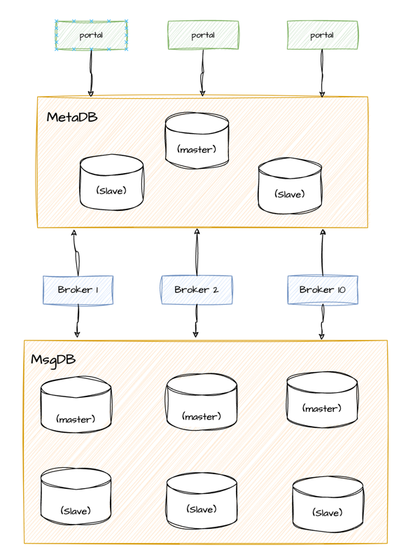

---

weight: 15
title: "Deplyment"
---

# Deployment Document

## Single-Server Deployment
For single-server deployment, please refer to another article 
- [Quickstart]()

## Distributed Deployment
CatMQ server has two components that need to be deployed: CatMQ-rest (server-side) and CatMQ-ui (portal-side). Both the server-side and portal-side are stateless and have an internally built simple service discovery feature. Therefore, they can be used and deployed without the need for other distributed platform(Like Spring Cloud Eureka, zookeeper).

To deploy, simply add the corresponding environment configurations in the following directories: `\catmq-rest\src\main\resources` and `\catmq-ui\src\main\resources`. For example, to add a configuration for the 'fat' environment, you only need to add the `application-fat.properties` file in the respective directory. The configuration items are the same as in other environments, with the values possibly being different.

CatMQ's self-made service discovery feature stores the status information of each server-side and portal-side in the database. Every 5 seconds, a heartbeat is registered. As long as the server-side and portal-side successfully connect to the database, automatic service discovery is enabled. This approach can also be combined with service discovery components such as Eureka, Nginx, zookeeper, etc.

The key aspect of CatMQ's distributed deployment lies in the cluster deployment of the database. It is recommended to deploy the metadata database using a master-slave configuration (1 master, 2 slaves) and entrust it to the infrastructure operations team for maintenance. This ensures the normal usage of metadata. The deployment architecture is illustrated in the following diagram:

