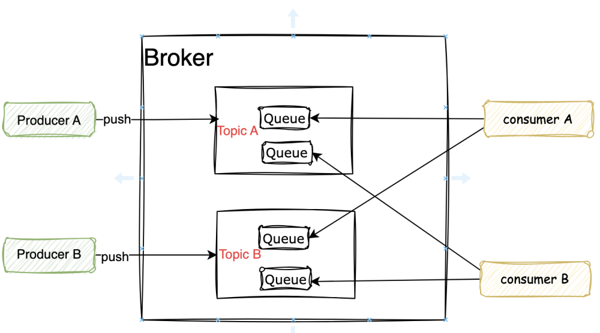
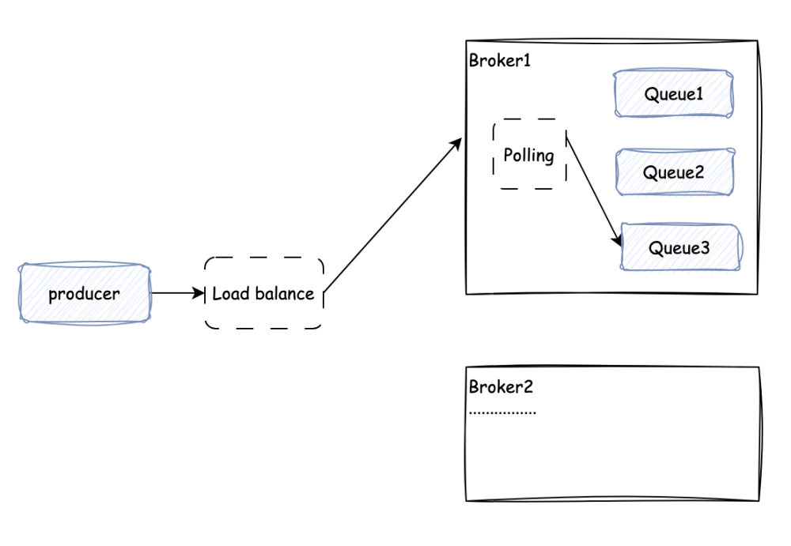
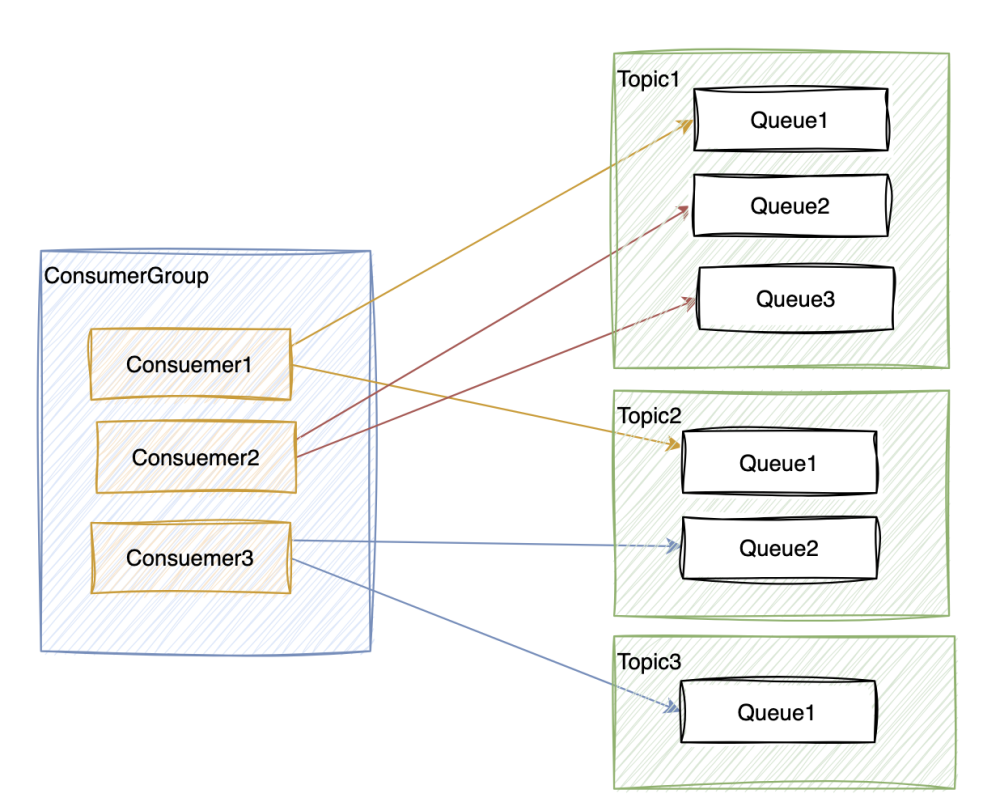
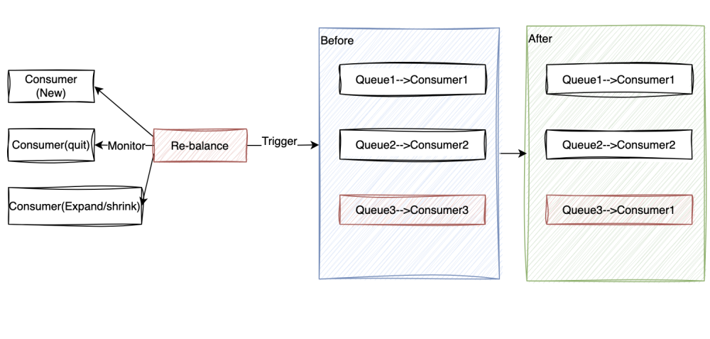

# Server Design

The three core functionalities of CatMQ are message sending, message storage, and message retrieval. The implementation of CatMQ is illustrated in the following diagram:

The diagram provides a simple overview of the CatMQ message flow, including sending, storage, and consumption processes.

Now, let's address four key questions:

1. How does the server store messages in multiple queues for each topic?
2. How do consumers know which queue to pull data from for a specific topic with multiple queues?
3. What is the impact if a consumer fails?
4. What is the impact if a server fails?

## 1. Message Storage Design

The data flow for message storage on the server is depicted in the following diagram:

As shown in the diagram, the process for submitting messages by the producer involves the following steps:

1. The producer sends a request, and load balancing distributes the traffic to a specific broker.
2. Upon receiving the request, the broker distributes messages to queues based on the actual number of queues for Topic A and a counter, using round-robin storage.
3. Load balancing is implemented using a simple setup with Nginx, rather than popular solutions like Dubbo or Spring Eureka.

## 2. Queue Assignment Design

How does a consumer know which queue to pull data from?

During consumer registration, the server allocates queues to consumers based on the logic shown in the following diagram:

As illustrated, the fundamental design is that one consumer can correspond to multiple queues, and one queue can only correspond to one consumer—forming a one-to-many relationship between consumers and queues.

Upon system startup, when consumers register, the server needs to allocate queues based on the number of consumers in the consumer group and the number of queues subscribed to by the consumer group for all topics. The principle is to balance the relationship between consumers and queues as evenly as possible. The relationship between the consumer group and queues is registered in the queueOffset table. A daemon thread continuously maintains the queueOffset table to ensure real-time accuracy of the data.

For example, in the corresponding relationship shown in the diagram, the consumer group has three consumers, and the consumer group has been allocated a total of six queues for subscribed topics. The system's allocation algorithm aims to evenly distribute these six queues among the three consumers.

During normal system operation, if the number of consumers changes or the number of queues for the current topic changes, how does the system ensure the consistency of the relationship between consumers and queues? This is addressed in the next section on re-balancing design.

## 3. Re-balancing Design

To address the dynamic changes in the number of consumers and queues, we have a separate design for consumer and queue re-balancing, as shown in the following diagram:

As shown in the diagram, the logic for re-balancing is as follows:

1. CatMQ has a re-balancer that monitors the addition and removal of consumers, as well as topic expansion and contraction.
2. When changes are detected, the re-balancer triggers re-balancing operations on the affected consumer group. In the diagram, Consumer3 is leaving the consumption.
3. The re-balancer reallocates consumers and queues for the consumer group that needs re-balancing. In the example shown, Queue3 is assigned to Consumer1 for consumption.

## 4. High Availability Design

As a distributed message queue system, CatMQ is designed for distribution and high availability. For more details, you can refer to the - [HA Design]().