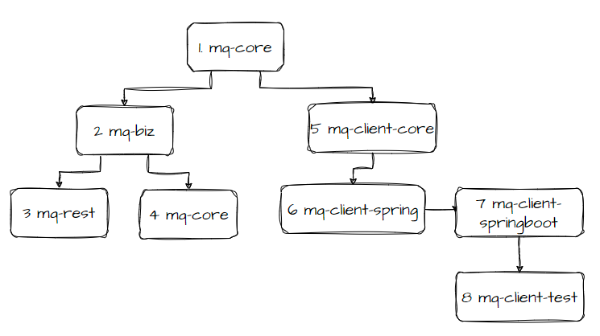
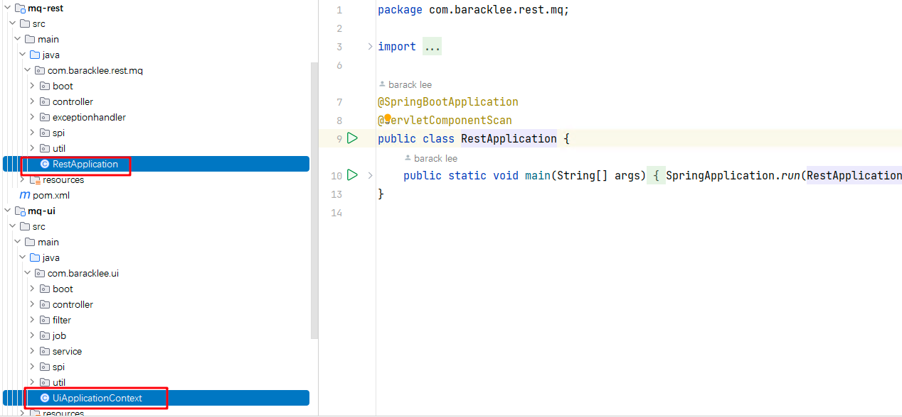

---

weight: 16
title: "开发须知"
---

# CatMQ develop guide
This module mainly introduces the code structure and project modules of the project, which is a convenient reference 
for students who plan to study this project carefully and those who want to develop it again.

## 1. Module Structure

1. mq-client\mq-core
   mq-core is the most basic module in catMQ, as it name,which contains the most basic dto objects and public methods. The basis for all projects
2. mq-biz
   mq-biz is the business logic processing layer, service and server-side broker and page operation and maintenance-side portal, which contains database entities and many scheduled polling threads, used by mq-rest module and mq-ui module
3. mq-rest
   mq-rest is the broker server of catMQ, which is used to provide rest services to clients. It mainly provides message sending, message pulling, heartbeat requests, and rebalancing.
4. mq-ui
   catMQ's portal interface provides users with a visual operation and maintenance interface.
5. mq-client\mq-client-core
   The core of the client, does not rely on third-party jar packages except for the http, and encapsulates the client's interface.
6. mq-client\mq-client-spring
   mq-client-core is encapsulated in spring to simplify operations and provides some service statistics interfaces
7. mq-client\mq-clent-springboot
   mq-client-core springboot start module
8. mq-client-test
   catMQ client demo

## 2.  Local Develop Environment
In `application.properties` config file default set `spring.profiles.active=fat`，set as fat。
and the jdbc connection is in application.properties too，there are two modules that require database configuration
connection are mq-rest and mq-ui.

## 3. Start in IDEA
To locally start the application, you need to launch two services. Click on 'Debug' for 'RestApplication' to start 
mq-rest. Then click on 'Debug' for 'UiApplication' to start mq-ui, as shown in the following screenshot:"

