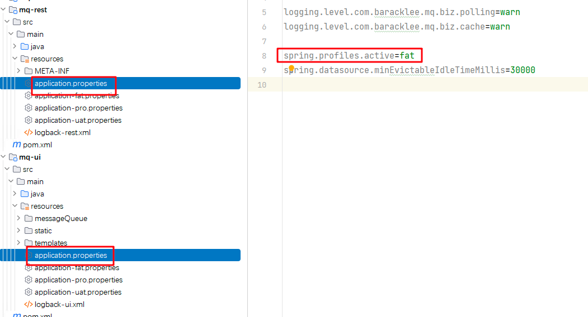

---

weight: 16
title: "开发须知"
---

# CatMQ的开发指南
本模块主要介绍项目的代码结构和项目模块，方便打算仔细研究本项目的以及想二次开发的同学做参考

## 1. 模块依赖图

1. mq-client\mq-core
   mq-core 是CatMQ中最基础的模块,里面是最基础的dto对象和公用方法。所有项目的基础
2. mq-biz
   biz 是业务逻辑处理层，服务与服务端broke和页面运维端portal，里面是包含数据库实体和很多定时轮询线程。供mq-rest模块和mq-ui模块使用
3. mq-rest
   mq-rest是CatMQ的broker服务端，用来对客户端提供rest服务，主要提供消息发送，消息拉取，心跳请求，重平衡。
4. mq-ui
   CatMQ的portal界面，提供给外部运维一个可视化的运维界面
5. mq-client\mq-client-core
   客户端的核心，除了http服务以外，不依赖第三方jar包，封装了客户端的接口
6. mq-client\mq-client-spring
   对mq-client-core做了spring封装，以便于简化操作，并提供了一些服务统计接口
7. mq-client\mq-clent-springboot
   mq-client-core 的符合springboot 的自动化配置
8. mq-client-test
   CatMQ的客户端demo

## 2. 本地开发环境
在application.properties配置文件中默认了spring.profiles.active=fat配置，指定为fat环境。
数据库的连接也在application.properties中，一共有两个模块需要数据库配置连接，分别是mq-rest和mq-ui

## 3. 本地启动
本地启动需要启动两个服务，点击RestApplication的Debug'RestApplication',启动mq-rest。点击UiApplication的Debug'MqUiApplication',
启动mq-rest。如下图所示：

