# 一、发送模块

## 1.1、创建消息主题（即topic）

发送方（producer）发消息到指定Topic之前，需要通过catMQ的portal创建该Topic，如果该Topic已存在则无须创建。下面演示一下如何创建Topic，和创建Topic时的注意事项：
 

点击最下方的“commit”按钮，完成topic的创建，进入如下页面：   

图中可以看到我们刚刚创建的topic：testtopic   
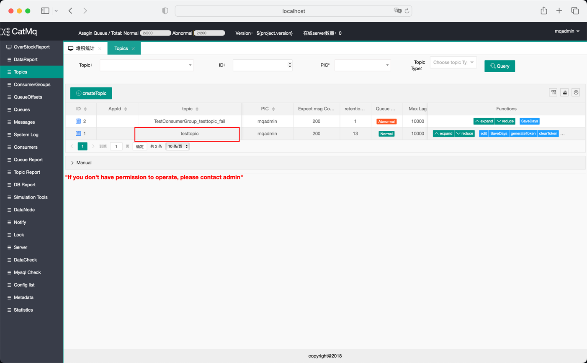
点击每条记录最左侧的蓝色图标，可以查看该topic的操作记录。

创建topic的注意事项：

1. Topic的名字不能以“_fail”结尾，因为系统以“_fail”结尾的Topic默认为存储失败消息的topic。
2. 负责人为该Topic的负责人，可以多选。Topic负责人拥有的权限为：
    - 编辑Topic的基本信息。
    - 更改Topic中存储消息的保留天数。
    - 生成和清除该Topic接收消息时的校验Token，修改Token时需慎重。
    - 对该Topic进行扩容，自动扩容时受限于预期每日消息量。
    - 对该Topic对应所有订阅的消费者产生的失败存储Topic的扩容以及更改保留天数。
    - 删除该Topic，注意当存在消费者订阅该Topic的时候，不能删除。
    - 可以在消息查询中查看该Topic中的消息发送的情况。
3. 堆积告警数默认10000，即当待处理消息达到10000时，会向发生堆积的订阅者 发送消息堆积告警。

# 二、消费模块

## 2.1、创建消费者组（即consumerGroup）

在“ConsumeGroup”页面，点击“create”按钮，进入“创建消费者组”页面：
 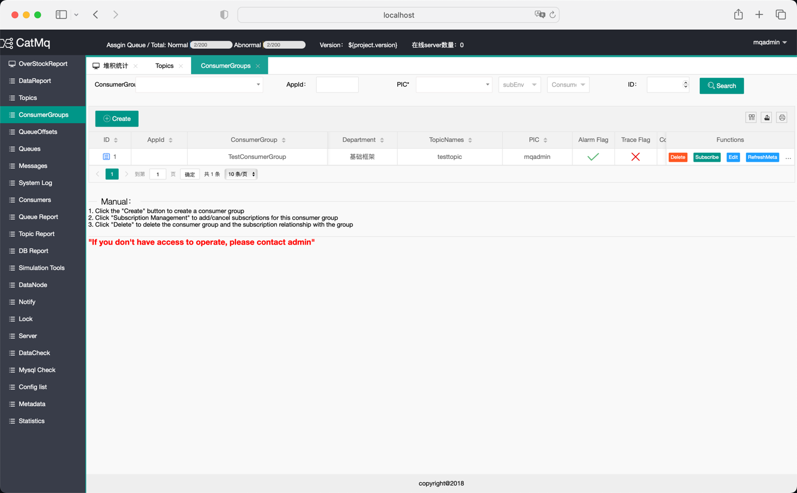
 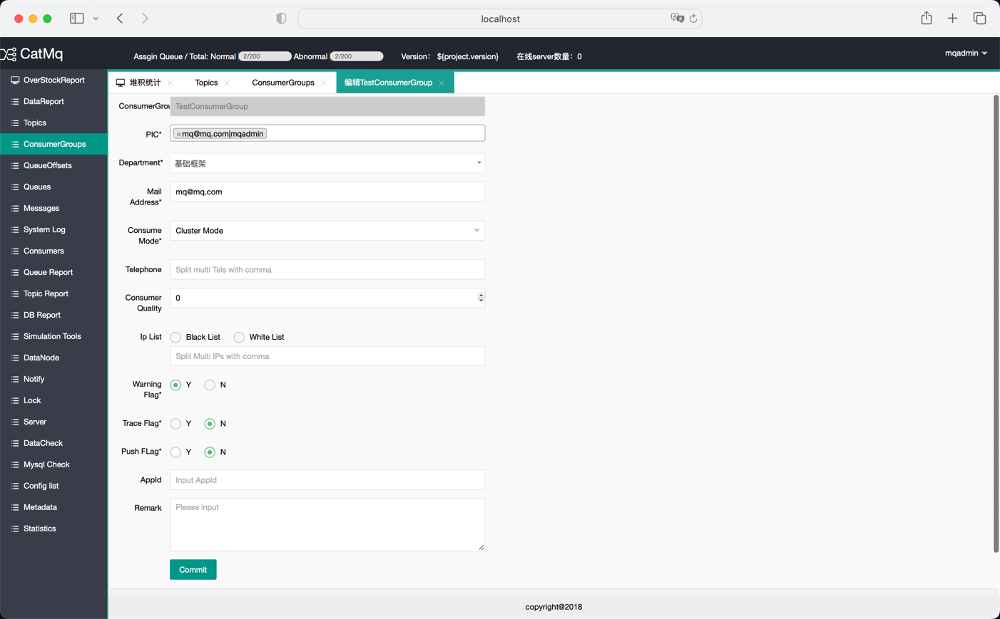

注意事项：

1.  消费者组名字最好以ConsumerGroup结尾，便于识别。
2.  消费者组负责人可以多选，负责人权限为：
- 编辑该消费者组的基本信息。
- 消费者组的订阅管理，主要是添加与topic的订阅关系。
- 强制刷新，刷新broker中内存的该消费者组的订阅关系，便于客户端获得最新的订阅关系。
- 删除该消费者组。
- 触发该消费者组的重平衡（即该消费者组下consumer实例的重新分配）。
3.  告警邮箱地址可以多个以英文逗号分隔，告警手机可以多个以英文逗号分隔。
4.  消费机器数为消费的实例数，即启动的应用实例数，主要为了和消息系统2.0相对应。
5.  黑白名单，为了限制哪些机器不可以消费和只可以哪些机器消费，只能选择其中一个。
6.  是否告警，建议当机器消费实例启动后开启。
7.  消息追踪，主要为了追踪消息在消费者中消费情况。
8.  最大实例数用于设置消费者的最大数量，0表示不加限制。
9.  消费模式：CatMQ有三种消费模式，分别是集群模式、广播模式、代理模式。
- 集群模式：CatMQ最常用的是集群模式（默认的模式）。consumerGroup订阅的topic下的队列会被均匀的分配到我们的消费端实例上（即多个消费端实例共同消费topic中的消息，每个消费端实例只能消费到topic的一部分消息）。
- 广播模式：每个消费端实例都可以消费到consumerGroup订阅的topic的所有消息（即consumerGroup下的每个消费端实例，都可以消费到全部的消息。并且每个消费端实例所消费的消息完全一样）。

图中可以看到我们刚刚创建的消费者组：test1sub。

点击每条记录最左侧的蓝色图标，可以查看该consumerGroup的对应操作功能。

## 2.2、消费者组订阅管理（即consumerGroup和topic的订阅关系）

点击上图消费者组test1sub右侧的“订阅管理”按钮，进入到“TestConsumerGroup订阅管理”页面：

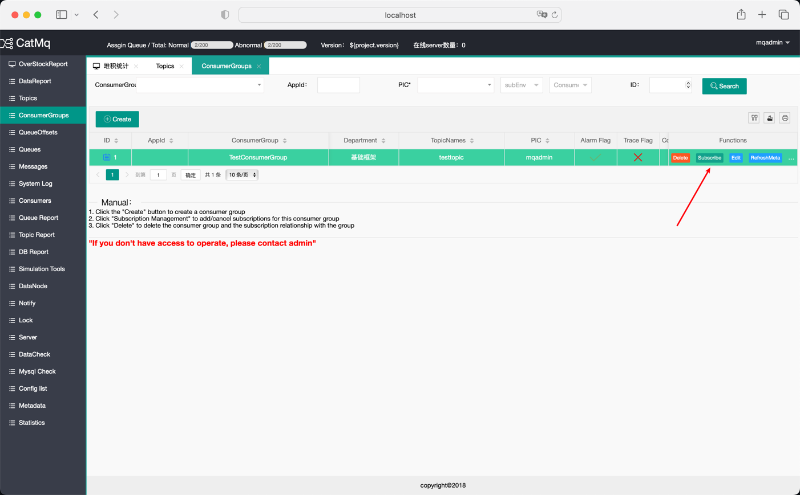  
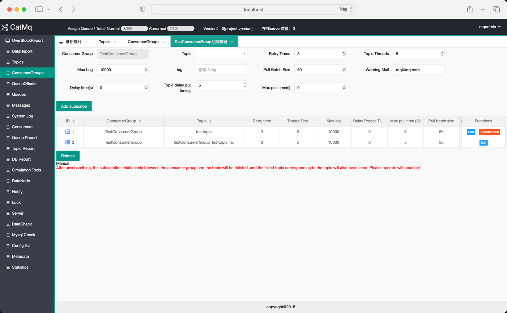  
在上图“主题名称”处选择test1sub想要订阅的topic：test1。选择配置参数后，其中注意事项如下：

1. 重试次数，作用于失败Topic，当消费失败的时候，消息会被发送到失败topic中，另外一个线程会去消费失败Topic中的消息，即进行失败消息的重试，重新消费成功则pass，否则继续重试直到达到最大重试次数。
2. 线程数量，批量消费的线程数量，即同一个队列使用多少个线程去消费，线程数不能超过50。
3. 告警阀值，当消息堆积达到该值时会发送告警邮件。
4. tag，值消息的标识，设置tag之后，消费者组只能消费这个Topic下带有该Tag的消息。
5. 延迟时间（即延迟处理时间），以毫秒为单位，主要为了满足一些需要延迟去消费的场景，延迟时间最大为259200ms。
6. 拉取条数，是指每次去向broker拉取多少条消息到客户端去消费，相当于一个本地缓存队列，然后本地线程去消费缓存队列里面的消息，批量拉取条数最大为500。
7. 拉取等待时间，设置拉取线程的延迟等待时间。
8. 消费熔断时间，即客户端处理消息的最大消耗时间。超过设置时间则熔断，单位秒,0表示不熔断。

点击“添加订阅”完成订阅，当前页面下方会显示该消费者组订阅的所有Topic，同时也包含了订阅该Topic所产生的失败Topic，如下如所示：

其中注意事项如下：

1. 其中失败Topic的命名规则为：ConsumerGroupName_TopicName_fail，当添加订阅的时候会创建该失败Topic并默认分配两个队列。（上图中test1sub_test1_fail就是test1sub订阅test1之后生成的失败topic，用于存储失败消息。）
2. 批量拉取条数和批量消费条数需要加以区分，批量拉取条数是每次向broker拉取的条数（例如一次从broker拉取50条消息存储到本地队列），批量消费条数是指每个线程每次去消费的最大条数（例如：一次从本地队列中拿10条消息，做批量入库操作），故会存在，批量拉取条数>=批量消费条数*线程数量
3. 点击编辑按钮，可以设置该消费者订阅该Topic的重试次数、告警阀值、tag、延迟时间、线程数、批量拉取条数、批量消费条数、告警邮件等
4. 点击“Unsubscribe”，解除消费者组和topic的订阅关系。
5. 一个消费者组可以订阅多个topic，注意失败topic是自动生成的，不用单独订阅。

# 三、管理模块

## 3.1 堆积统计

CatMQ的portal，登陆之后默认展示“OverStockReport”页面：
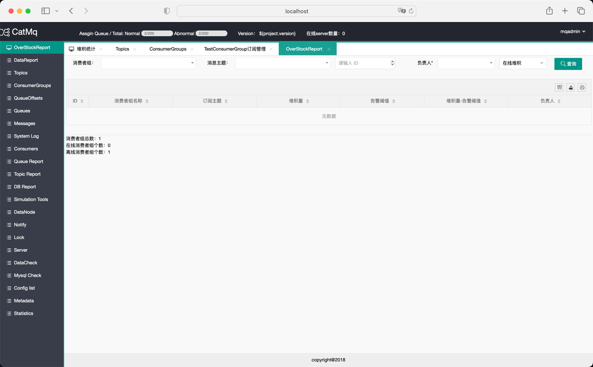

“堆积统计”页面，用于统计展示consumerGroup的消息堆积情况。

## 3.2 数据统计

“DataReport”用于展示数据节点（即消息数据库节点）的信息。

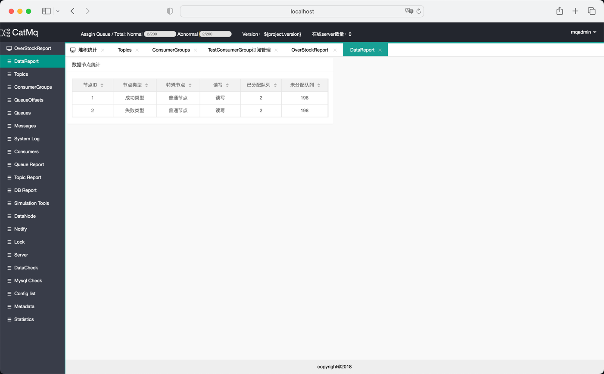
 注意：消息库中的一张表代表一个消息队列。上表的信息解读为，节点1是储存正常的消息，现在已经分配出去两个队列，还有198条队列没有分配出去

## 3.3 队列消费管理

“队列消费管理页面”用于展示consumerGroup对topic下每一个队列的消费情况，每一条记录对应着一个队列。

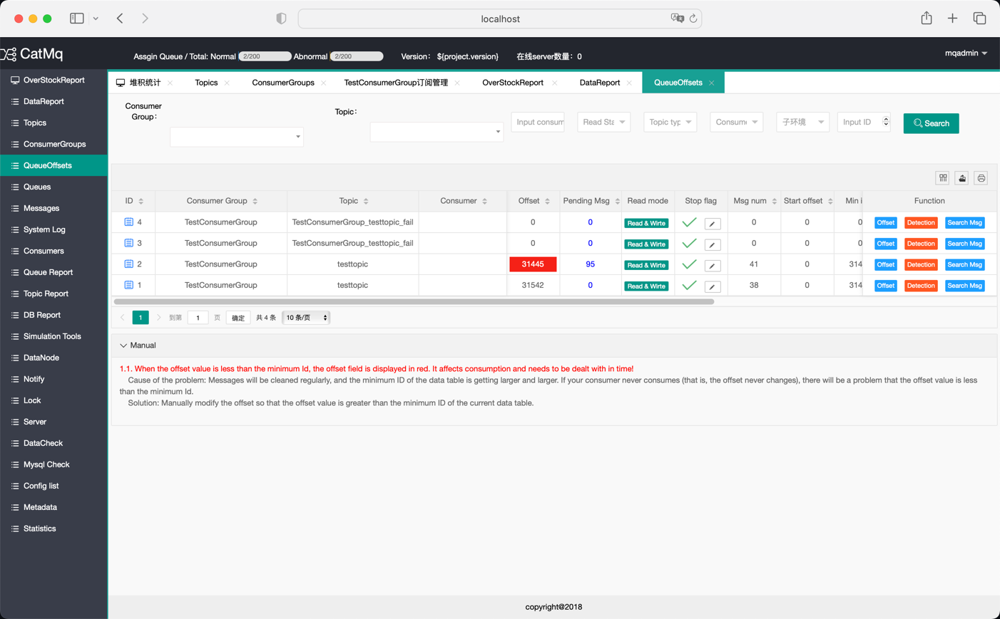

消费端实例（消费者）成功启动之后，消费端实例会订阅一个或者多个相关队列，参数说明如下：

- 消费者：又叫消费端实例，根据重平衡策略，consumerGroup订阅的所有topic下的全部队列，会均匀分配给启动的消费端实例。
- 偏移量：是指当前队列中的消息，被消费到的位置。消息表（即队列）中的id是自增的，所以偏移量就是刚被消费的那条消息的id值。
- 待处理消息数：未被处理的消息数量，待处理消息数=队列中消息的最大id-当前偏移量。
- 读写类型：队列的读写类型分为读写和只读。类型为读写时，该队列既可以插入消息又可以消费消息。类型为只读时，该队列只能消费消息，不能插入。注意：这里需要保证一个Topic下至少存在一个可以读写的队列。点击旁边的白色按钮，即可进行读写类型的编辑。
- 消费标志：队列的消费标志分为正常消费和停止消费。正常消费顾名思义就是该队列的消息能够被正常消费，停止消费则表示该队列中的消息不能被消费，此时消费端不会去拉该队列中的消息。点击旁边的白色按钮，可以进行消费标志的编辑。
- 消息总数：队列（消息表）中的消息数量，因为我们会定时清理队列中过期的消息，所以消息总数=队列中消息的最大id-队列中消息的最小id，故会存在偏移量大于消息总数的情况。
- 起始偏移：是指该消费者组订阅该Topic时，该队列中消息的最大id。即消费者组开始消费消息时的位置。
- 最小id：该队列（消息表）中消息id最小的记录的id。
- Topic类型：正常则为存储普通消息的Topic的队列，失败则为存储失败消息的队列，和存储类型对应。
- 分区id：该条记录对应的队列的id，可以在队列管理中查询到队列相关的信息。
- 存储类型：是指该队列的存储类型，一般我们使用失败类型的队列储存失败Topic中的消息，正常类型的队列存储正常类型Topic中的数据。
- db节点：表示该队列对应于某个数据库中的某张表，消息都是存储在这个表中的，db节点=数据库的域名+数据库的库名+数据库的表名。
- “偏移”按钮：管理员可以通过点击“偏移”按钮，来调整消费者在该队列中的消费位置。实时生效，谨慎操作。

## 3.4 队列管理

“队列管理”中的每一条记录，代表着一个队列即一张消息表。

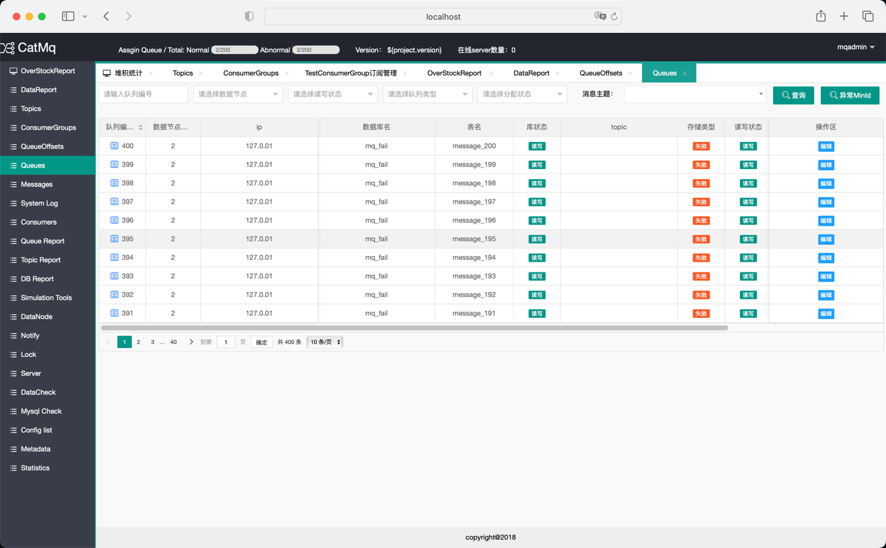

每个队列对应消息数据库中的一张表，可以通过ip+库名+表名定位到具体的哪张表。

点击每条记录最左侧的蓝色图标，可以查看该queue的操作记录。

参数说明：

- 队列编号：即该队列在queue表中的id。
- 数据节点编号：该队列（消息表）所属的数据库节点，在db_node表中的id。
- ip: 该队列（消息表）所属数据库节点的域名数据库。
- 数据库名：该队列（消息表）所属数据库节点的名称。
- 表名：该队列（消息表）对应的表名称。
- 库状态：该队列（消息表）所属数据库节点的读写类型。读写表示该数据库既可以插入消息又可以拉取消息，只读表示该数据库只能拉取消息，不能插入。
- topic：该队列被用于存储那个topic的消息。该字段为空表示:队列还未被分配。
- 存储类型：正常表示存储普通消息，失败表示存储处理失败的消息。
- 读写状态：读写表示该队列既可以插入消息，又可以拉取消息。只读表示该队列只能拉取消息，不能插入。
- 消息总数：队列（消息表）中的消息数量。
- 最小id：该队列（消息表）中消息id最小的记录的id。
- “编辑”按钮：队列没有被分配时，该记录的最右侧可以看到“编辑”按钮，点击“编辑”可以为该队列分配topic。
- “设为只读”：队列被分配给某个topic以后，右侧可以看到“设为只读”。点击该按钮可以把当前队列改为只读状态。
- “移除”：队列被分配给某个topic以后，右侧可以看到“移除”。点击“移除”，会进入该topic的缩容页面。

例如点击上图中的“移除”按钮，会进入topic：test1的缩容页面：
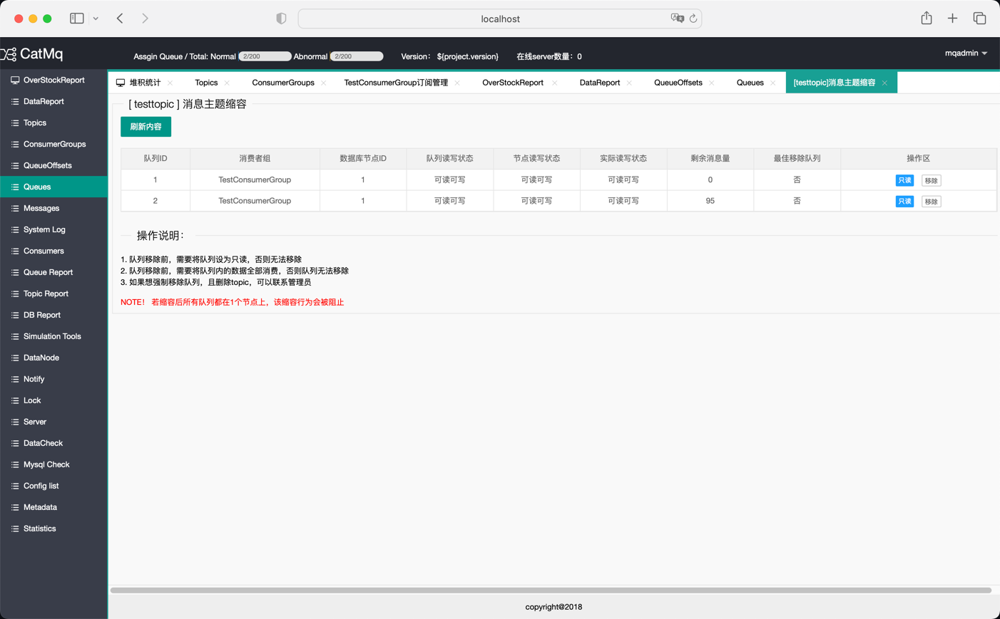

例如：上图中topic：testtopic拥有两个队列，如果要对testtopic进行缩容，需要先对其中一个队列设置成只读。假设要缩容掉id为1的队列，步骤如下：

- 点击id为1的队列右侧的“只读”按钮，把队列设为只读。
- 点击1右侧的“移除”按钮，完成test1对9173队列的缩容。

## 3.5 消息查询

消息查询主要用于发送方和消费方查看消息，消息查询中具有权限控制：

- 作为发送方只能查看到该用户负责的Topic的消息。
- 作为消费方只能查看到该用户所负责的消费者组中订阅的Topic里面的消息。

- 消息查询中可以查看正常类型的Topic的消息，也可以查看失败类型的Topic的消息
- 对于失败类型的Topic中的消息，如果想重新消费，先选择想要重新消费的消息，然后点击“批量重新发送”按钮，则失败消息会重新发送到失败类型的Topic中，便于该消费者重新消费。
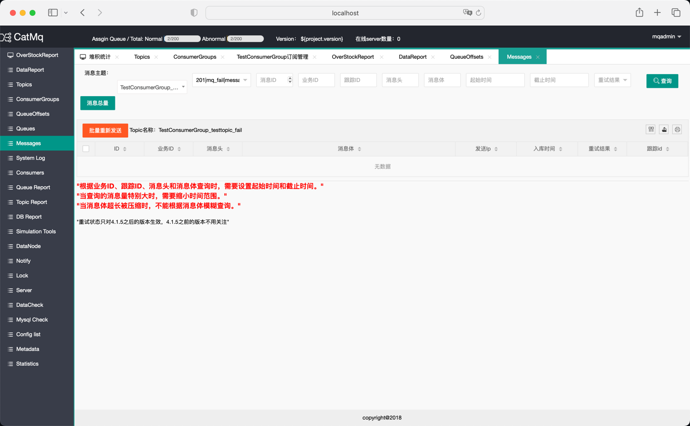

## 3.6 日志查询

日志查询页面，用于展示用户操作portal的审计日志：

## 3.7 消费者查询

消费者查询页面，可以根据consumerGroup查询该consumerGroup下的consumer（即消费端实例）。
 
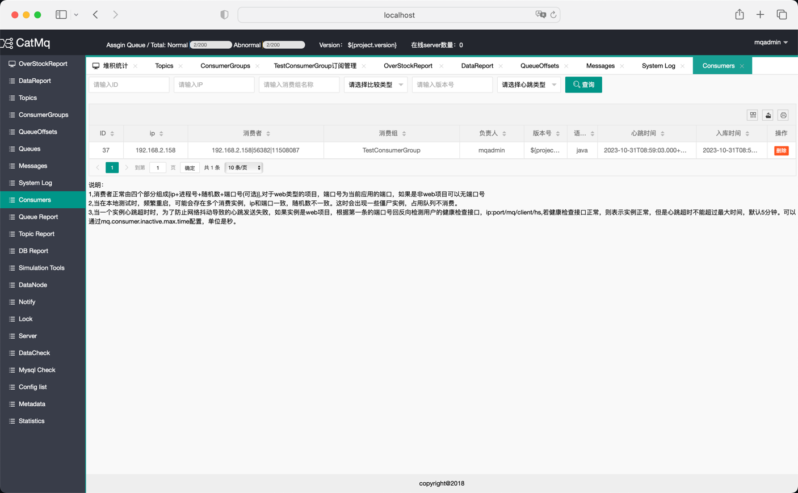
 
消费者查询，主要用来查询该消费者组中启动成功的消费端实例：

- 其中消费者实例=ip地址+进程号+随机数+端口号。
- 消费者实例会定期发送心跳给broker，没有心跳的消息者实例会被定时任务清理掉。

## 3.8 队列报表

队列报表，用于统计每个队列中的消息总量、平均每天的消息发送量。

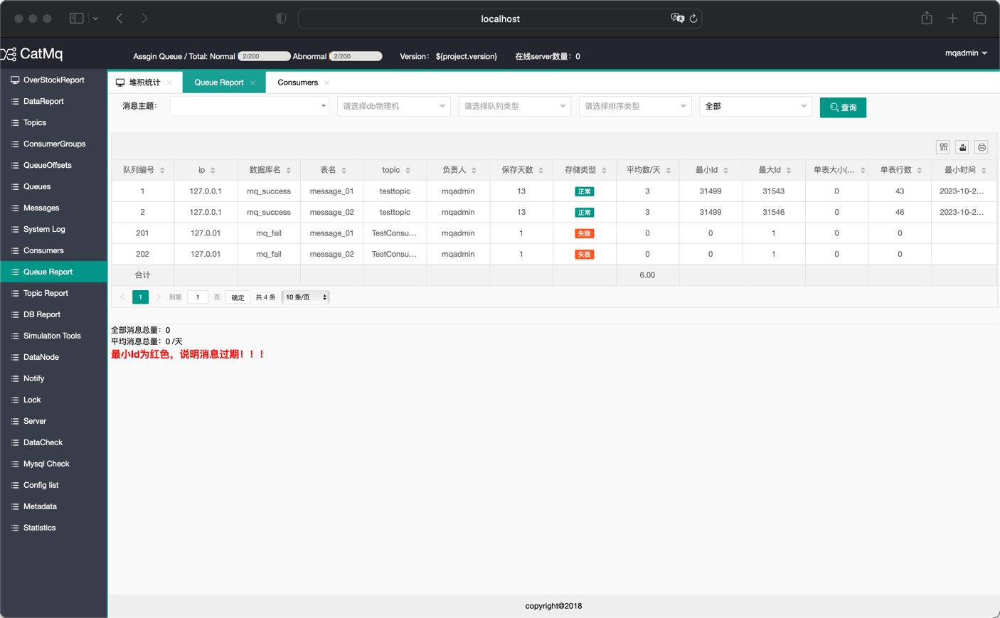

图片左下角的“全部消息总量”为所有队列中的消息量的和。同理，“平均消息总量”为所有队列每天存入消息的平均值。

## 3.9 topic报表

topic报表，用于监控统计每个topic下的消息量（每个topic下有多个队列即消息表），以及topic下队列分配的合理性。页面如下图所示：

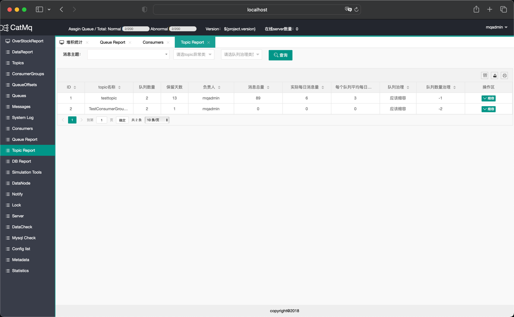

字段说明：

- 消息总量：该topic下所有队列，存储的消息量总和。
- 实际每日消息量：该topic每天存入的消息量。
- 每个队列平均每日消息量：topic下每个队列每天存入的消息量。
- 队列治理：我们根据topic和topic下每个队列的消息总量以及平均消息量，对topic的队列分配数量进行监控统计，分析队列分配的合理性。如果平均消息量过多，会给出“应该扩容”的建议。如果消息量过少，会给出“应该缩容”的建议。
- 队列数量治理：队列治理的具体值，例如-1表示应该缩容掉一个队列（即减少一个队列），2表示应该扩容两个队列（即增加两个队列），0表示队列分配合理。
- 操作区：如果topic需要缩容，右侧会展示“缩容”按钮，点击缩容会进入该topic的缩容页面。同理如果topic需要扩容，右侧会展示“扩容”按钮

## 3.10 物理机报表

物理机报表，用于统计展示每台消息库物理机的消息总量、平均每天入库的消息量。

## 3.11 发送工具

为了方便测试人员，我们开发了一个消息发送页面。通过“Simulation Tools”页面，可以简单的实现消息的发送。
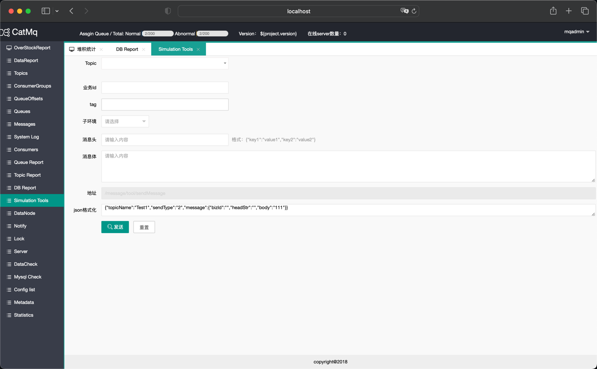

# 四、系统管理员模块

注意：以下页面仅对系统管理员展示。

## 4.1 数据节点管理

数据节点管理，用于消息库节点的创建、编辑、以及创建消息表与元数据库mq_basic中的queue表的对应关系。

点击“创建”按钮，弹出创建节点的弹框，创建节点时需要注意：

- 主库ip和从库ip不能一样。
- 读写状态：默认为可读可写，表示数据库可以插入也可以查询。
- 存储类型：选择“正常队列消息”表示该库用于存储普通消息，选择“失败队列消息”表示该库用于存储处理失败的消息。

“批量对比”按钮，用于为所有库节点的消息表创建与queue的对应关系。

右侧操作区按钮说明：

- 编辑：点击“编辑”按钮，可以修改消息库节点的信息。
- 生成sql:生成创建表的sql语句。
- 对比：为当前消息库节点的消息表创建与queue的对应关系。
- 分析：查看该消息库节点下topic的分布情况。
- 更改状态：修改当前节点的读写状态。
- 生成insert：生成插入消息库节点记录的sql语句样例（把节点记录插入db_node库中的语句）。

## 4.2 通知查询

通知查询，用于展示重平衡请求记录的信息（表中的每一条记录表示一个重平衡请求），以及重平衡器当前处理到的位置（即重平衡器处理到了第几条请求）。

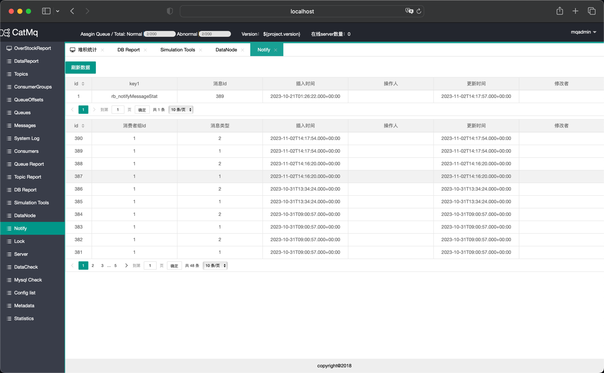

通知查询页面包含两张表，图中蓝色标注的表格记录“重平衡器”当前处理到第几条“重平衡请求”（即重平衡器的处理位点）。图中红色标注的表格记录所有重平衡请求（每一条记录都是一个重平衡请求），记录中的消费者组Id就是触发重平衡的consumerGroup的id。

## 4.3 lock

CatMQ中有一些定时器，lock页面用于展示定时器与portal实例的对应关系（定时器会被portal实例抢占执行，如果定时器A被portal实例1抢占了，其他的portal实例则抢占不到定时器A了。）

上图中ip表示的是portal实例的IP地址，key1表示的是不同定时器的名字，具体含义如下：

- mq_auditlog_clean_sk：操作日志清理定时器。
- mq_message_clean_sk：消息清理定时器。
- mq_noSubscribe_sk：未订阅检查定时器。
- mq_redundance_check_sk：冗余检查定时器。
- mq_NoActiveConsumer_sk：服务端心跳异常检测定时器（检测心跳异常的客户端）。
- mq_queueExpansion_sk：队列空间检查定时器。
- mq_notify_clean_sk：清理重平衡请求和缓存更新请求的定时器。
- mq_messageLagN_sk：消息堆积检查定时器。
- mq_rb_sk：重平衡检查定时器。

## 4.4 server

server展示的是broker服务端的实例列表。CatMQ的客户端可以通过两种方式去连接broker服务端，第一种是通过域名的方式（通过nginx）,第二种是通过ip直连的方式（客户端会定时拉取broker服务端实例的ip列表，通过ip地址直接访问）。  注意：通过ip直连时，需要在server列表中，把可以被访问的broker服务端实例的statusFlag状态位打开（即允许该broker实例接入流量）。

CatMQ默认采用ip直连的方式（记得去server列表中打开statusFlag状态位）。CatMQ通过配置的方式来实现域名访问和ip直连方式的切换。具体方式如下：

-  CatMQ的客户端和服务端分别有一个配置项，都叫做mq.broker.metaMode。
-  服务端的mq.broker.metaMode默认值为1，表示强制指定为ip直连的方式（此时客户端的mq.broker.metaMode的配置失效）。
-  如果服务端的mq.broker.metaMode的值设置为-1，表示强制指定为域名访问的方式（此时客户端的mq.broker.metaMode的配置失效）。
-  如果服务端的mq.broker.metaMode的值设置为0，表示根据客户端的mq.broker.metaMode配置决定访问方式：
    - 客户端的mq.broker.metaMode值默认为true，表示使用ip直连的访问方式。
    - 如果客户端的mq.broker.metaMode值为false，表示使用域名访问的方式。

注意：只有服务端的mq.broker.metaMode值为0时，客户端的mq.broker.metaMode配置才会生效。

特表说明：发布时为了防止抖动，需要先将待发布的服务端实例关闭，默认30秒同步到客户端，发布完成打开statusFlag状态位。

## 4.5 mysql连接数

该页面用于展示CatMQ的元数据库和消息库所在物理机的连接数，如下所示：

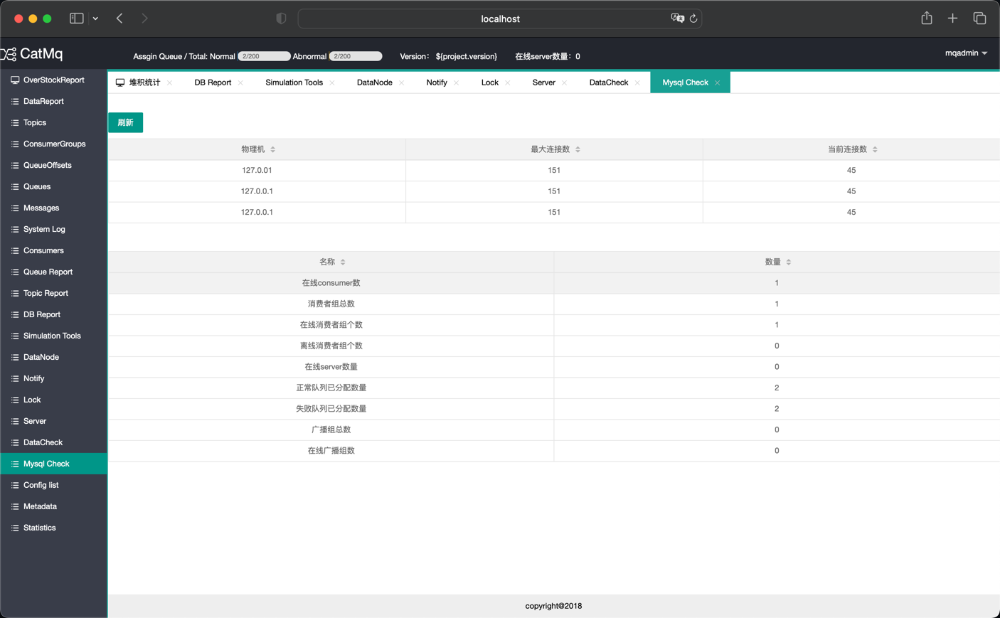

上图中物理机表示的是元数据库和消息库的域名。

## 4.6 配置列表

配置列表，用于展示配置类soaConfig中所有配置的名称、默认值、当前值、以及配置说明，如下图所示：

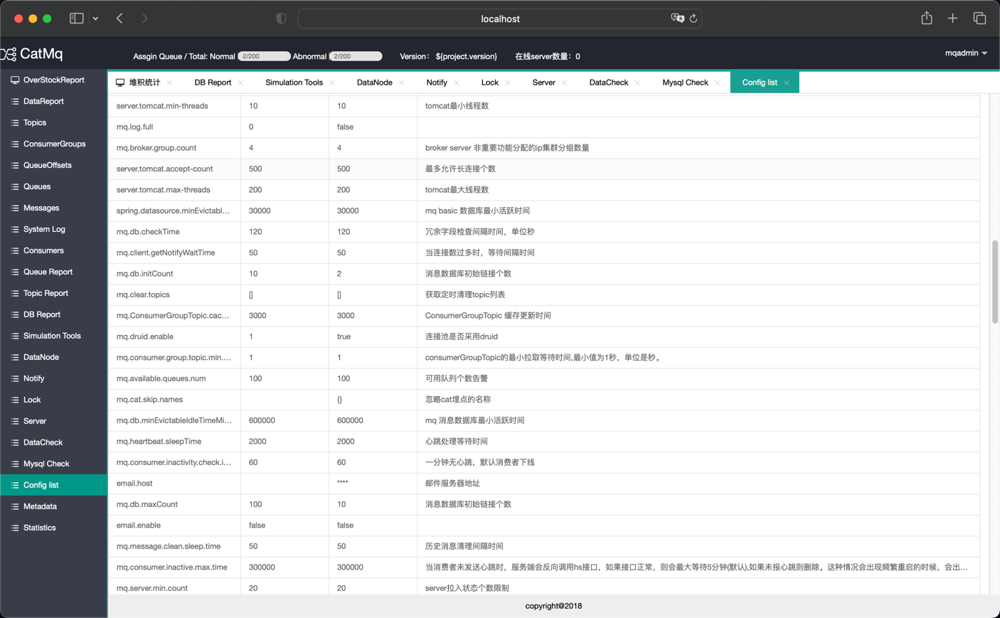

## 4.7 元数据同步

元数据同步页面，用于多个环境之间同步topic、consumerGroup、以及订阅关系（即consumerGroup订阅了那几个topic）。

 具体步骤如下： 假设我们要把fat环境的元数据同步到uat环境

-  同步topic：
    - 首先进入fat环境的“元数据同步”页面，在“请选择同步类型”处选择“同步topic”。
    - 点击生成按钮，fat的界面上会生产成所有topic的json串，复制生成的json串。
    - 然后进入uat环境的“元数据同步”页面，在“请选择同步类型”处选择“同步topic”。把上一步复制的json串，粘贴到uat的文本区域。
    - 点击uat环境中的“同步”按钮，则开始同步。同步完成时会有提示（由于批量同步量比较大，同步过程需要点时间）。
-  同步consumerGroup：
    - 首先进入fat环境的“元数据同步”页面，在“请选择同步类型”处选择“同步consumerGroup”。
    - 点击生成按钮，fat的界面上会生产成所有consumerGroup的json串，复制生成的json串。
    - 然后进入uat环境的“元数据同步”页面，在“请选择同步类型”处选择“同步consumerGroup”。把上一步复制的json串，粘贴到uat的文本区域。
    - 点击uat环境中的“同步”按钮，则开始同步。同步完成时会有提示（由于批量同步量比较大，同步过程需要点时间）。
-  同步订阅关系：
    - 首先进入fat环境的“元数据同步”页面，在“请选择同步类型”处选择“同步订阅关系”。
    - 点击生成按钮，fat的界面上会生产成所有订阅关系的json串，复制生成的json串。
    - 然后进入uat环境的“元数据同步”页面，在“请选择同步类型”处选择“同步订阅关系”。把上一步复制的json串，粘贴到uat的文本区域。
    - 点击uat环境中的“同步”按钮，则开始同步。同步完成时会有提示（由于批量同步量比较大，同步过程需要点时间）。

## 4.8 Statistic

队列统计report,可以根据实际数据去统计各个使用部门的消息总量的Report。

